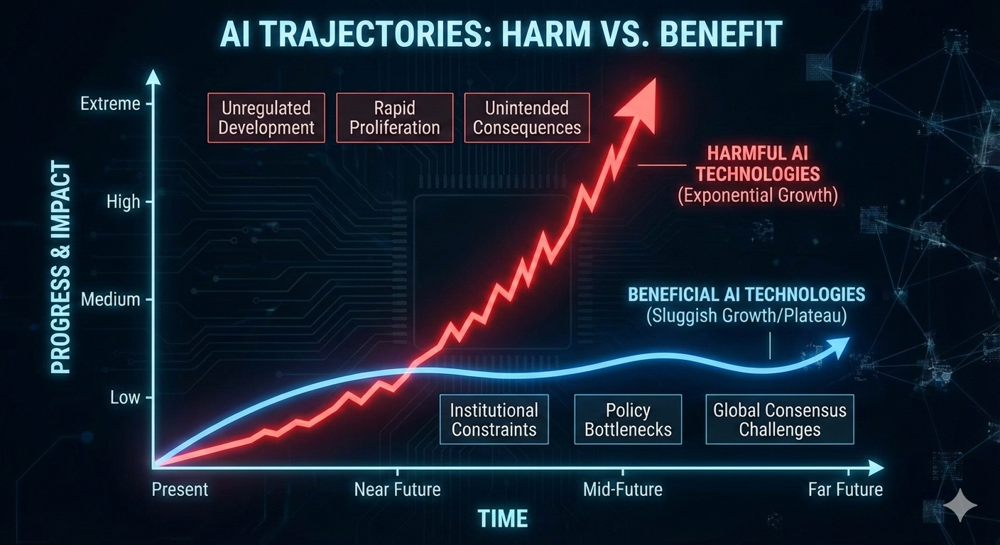

# The Velocity Gap: Why AI Harms May Outpace Benefits in a World of Institutional Inertia

**Abstract** As Artificial General Intelligence (AGI) and Artificial Superintelligence (ASI) transition from science fiction to technical roadmap, a dangerous asymmetry has emerged. While the theoretical benefits of these technologies are vast, their practical implementation is throttled by the "human layer"—the sluggish pace of institutional adaptation, policy-making, and global consensus. Conversely, the potential harms of AI—ranging from systemic bias and economic disruption to existential risks—operate at the speed of code. This paper argues that the primary challenge of the 21st century is not the technical alignment of AI, but the "institutional alignment" of human society to bridge this velocity gap.

---



### **1. Introduction: From AGI to ASI**

Artificial General Intelligence (AGI) represents the point at which a machine can perform any intellectual task a human can. Artificial Superintelligence (ASI) refers to an intelligence that surpasses human capability across all domains, including scientific creativity, social skills, and general wisdom.

As noted in Michael Nielsen’s *Which Future?*, the trajectory toward these milestones is often viewed through a purely technical lens. However, the impact of these technologies is mediated by the structures of our civilization. We are approaching a "Great Mismatch": the exponential growth of machine intelligence vs. the linear (or static) growth of human institutional capacity.

### **2. The Sluggish Growth of Benefits: The Friction of Consensus**

The "pro-social" benefits of AI—curing diseases, optimizing energy grids, or revolutionizing education—cannot be realized by code alone. They require integration into existing human systems. This process is inherently slow for three primary reasons:

* **The Regulatory Bottleneck:** For AI to revolutionize medicine, it must pass through clinical trials, FDA approvals, and insurance mandates. These are not just "red tape" but necessary safeguards that operate on timescales of years or decades.
* **The Problem of Consensus:** As Nielsen suggests, achieving a "good future" requires a collective agreement on what "good" looks like. In a world of 8 billion people with diverging values, religious beliefs, and economic interests, reaching a consensus on how to deploy ASI is a monumental task. Benefits are often held hostage by political polarization and geopolitical rivalry.
* **Institutional Adoption:** Schools, hospitals, and governments are notoriously slow to change. The "benefit" of AI in education is only realized when curricula are rewritten and teachers are retrained—a process constrained by human biological and social limits.

### **3. The Velocity of Harm: Exploiting the Path of Least Resistance**

Unlike benefits, which require the *cooperation* of institutions, harms often thrive on the *absence* or *failure* of institutions. Potential harms grow faster because they are "permissionless."

* **Asymmetric Scaling:** A single rogue actor or a poorly aligned algorithm can deploy a deepfake campaign or a cyberattack in milliseconds. To counter this, a society needs a consensus-driven defense policy, which takes months to draft.
* **The "Move Fast and Break Things" Paradox:** Innovation in AI naturally gravitates toward areas with the least resistance. It is easier to deploy an AI that maximizes "engagement" (often through outrage or misinformation) than it is to deploy an AI that provides "nuanced education," because the former requires no institutional permission to exploit human psychology.
* **Recursive Harms:** If an ASI begins to optimize for a goal that is slightly misaligned with human values, the "harm" can compound at silicon speed. Because our monitoring and intervention systems (courts, legislatures, international treaties) move at human speed, we may find ourselves in a "fait accompli" situation before a meeting can even be scheduled to discuss the remedy.

### **4. Synthesis: The Michael Nielsen Perspective**

In *Which Future?*, Nielsen highlights that our future is not a predetermined outcome of technology, but a result of the "social technologies" we build to manage it. If we rely on 19th-century institutions (nationalism, rigid bureaucracy) to manage 21st-century ASI, the "sluggishness" of our benefits will eventually lead to a collapse.

The "speculative harms" aren't just scary stories; they are the natural default of a system where the "offense" (technological change) is faster than the "defense" (social and policy adaptation). To harvest the benefits of AGI, we must innovate in our ability to reach consensus as quickly as we innovate in our ability to process data.

### **5. Conclusion: Bridging the Gap**

The disparity between the growth of AI benefits and harms is not a technical flaw, but a structural one. Benefits are constrained by the necessity of human agreement, while harms are liberated by the speed of automation. To ensure a flourishng future, we must focus less on the "intelligence" of the AI and more on the "latency" of our institutions. If we cannot speed up our ability to agree and adapt, we risk being overwhelmed by the very tools meant to liberate us.


### Interactive notebook

If you want to play around with some of these scenarios, here is some code below and a [Google Colab notebook](https://colab.research.google.com/drive/1Eo7oF2T7fBJrbfQ2P1M2XCJhqQu-8RwL?usp=sharing)

```python
%matplotlib inline
import matplotlib.pyplot as plt
import numpy as np
from ipywidgets import interact, widgets

def plot_velocity_gap(harm_growth, benefit_ceiling, inst_speed, policy_lag):
    time = np.linspace(0, 25, 250)
    
    # Models
    y_harm = 0.5 * np.exp(harm_growth * time)
    midpoint = 10 + policy_lag
    y_benefit = benefit_ceiling / (1 + np.exp(-inst_speed * (time - midpoint)))
    
    # Calculate Risk Score (Area between curves)
    risk_score = np.trapz(np.maximum(0, y_harm - y_benefit), time)
    
    # Plotting
    plt.figure(figsize=(10, 6))
    plt.plot(time, y_harm, color='red', lw=2, label='Harmful AI Potential')
    plt.plot(time, y_benefit, color='blue', lw=2, label='Realized AI Benefits')
    
    # Fill the gap
    plt.fill_between(time, y_benefit, y_harm, where=(y_harm > y_benefit), 
                     color='red', alpha=0.1, label='The Velocity Gap')
    
    # Formatting
    plt.title(f"AI Velocity Gap | Cumulative Risk: {risk_score:.2f}", fontsize=14)
    plt.xlabel("Years from AGI Emergence")
    plt.ylabel("Impact Magnitude")
    plt.ylim(0, min(max(y_harm)*1.1, 300))
    plt.grid(True, linestyle='--', alpha=0.6)
    plt.legend()
    
    plt.show()

# Interactive Sliders
interact(
    plot_velocity_gap,
    harm_growth = widgets.FloatSlider(value=0.25, min=0.1, max=0.4, step=0.01),
    benefit_ceiling = widgets.IntSlider(value=50, min=10, max=100, step=5),
    inst_speed = widgets.FloatSlider(value=0.4, min=0.1, max=1.0, step=0.05),
    policy_lag = widgets.IntSlider(value=0, min=-5, max=10, step=1)
);
```


---

**References**

* Nielsen, M. (2023). *Which future? (And what can we do about it?)*. [https://michaelnotebook.com/whichfuture/index.html](https://michaelnotebook.com/whichfuture/index.html)
* Bostrom, N. (2014). *Superintelligence: Paths, Dangers, Strategies*. Oxford University Press.
* Ord, T. (2020). *The Precipice: Existential Risk and the Future of Humanity*. Hachette Books.