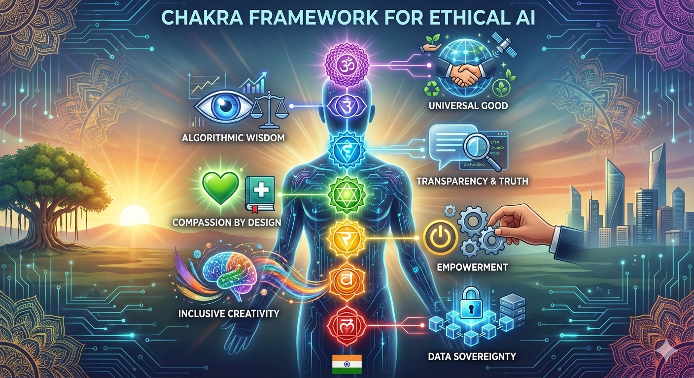

# Chakra framework for ethical AI

_Soumya Banerjee_

Can AI have a "soul"? Or more accurately, can the frameworks we use to build it reflect a deeper, more holistic human experience? 🇮🇳

As India carves its path in the global AI race, we aren't just looking at compute power and LLMs. We are looking at a paradigm shift: The Chakra Framework for Ethical AI.

While the Western AI discourse often centers on "Risk vs. Reward," the Global South has an opportunity to lead with "Alignment vs. Purpose." By mapping AI development to the Seven Chakras, we can create a blueprint for technology that serves humanity, not just shareholders.

 

## The 7 Chakras of Ethical AI
* Muladhara (Root): Data Sovereignty. Building on a stable foundation of localized, secure data that belongs to the people, not distant servers.
* Svadhisthana (Sacral): Inclusive Creativity. Moving beyond "standard" English datasets to reflect the linguistic and cultural fluidity of the Global South.
* Manipura (Solar Plexus): Empowerment. Using AI as a tool for agency—upskilling the workforce rather than automating them out of existence.
* Anahata (Heart): Compassion by Design. Ensuring AI interventions in healthcare and education are built with empathy and human-centric outcomes.
* Vishuddha (Throat): Transparency & Truth. Demanding "Explainable AI" that speaks clearly about its logic and its biases.
* Ajna (Third Eye): Algorithmic Wisdom. Using foresight to mitigate bias before it scales, looking beyond the immediate "fix" to long-term impact.
* Sahasrara (Crown): Universal Good. Aligning local innovation with global progress—AI that transcends borders to solve climate change and poverty.
 
## Why the Global South?

For too long, ethical AI standards have been exported from the North to the South. But a "one-size-fits-all" ethics doesn't work in a world of diverse values.
India’s synthesis of ancient wisdom and modern tech offers a "Digital Public Infrastructure" approach to ethics. It’s about moving from "artificial" intelligence to "aligned" intelligence.

The future of AI shouldn't just be smart; it should be centered.

#IndiaAI #EthicalAI #GlobalSouth #TechForGood #ArtificialIntelligence #DigitalSovereignty
 

