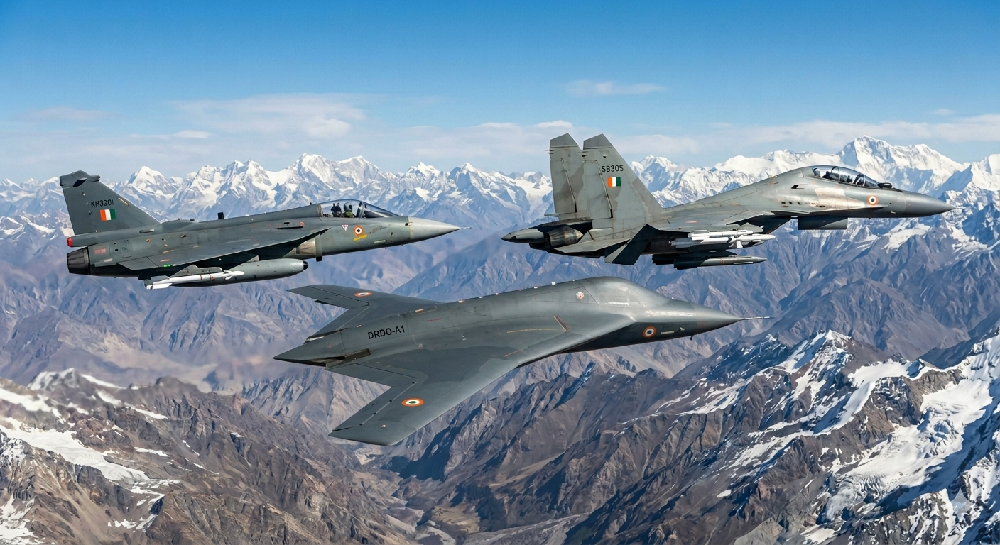

# The "Silent Wingman": How the Ghatak UCAV Will Redefine the IAF’s Combat Edge

For years, the debate in aerial warfare was Manned vs. Unmanned. But as the Indian Air Force (IAF) moves toward a more networked future, the answer isn't one or the other—it’s **both**. 

The recent momentum behind the **Ghatak** (formerly Aura) stealth UCAV program is more than just a technological milestone; it is the "missing link" that will turn the IAF’s existing fleet of **Dassault Rafales** and **Sukhoi Su-30MKIs** into a much more lethal, "un-interceptable" force.

### 1. The "Door Kicker": Ghatak and the Rafale
The Rafale is already a 4.5-generation masterpiece, equipped with the SPECTRA electronic warfare suite and the Meteor long-range missile. However, even the best manned aircraft faces risks in highly contested "Anti-Access/Area Denial" (A2/AD) zones.

* **The Synergy:** Imagine a Ghatak UCAV flying 100 km ahead of a Rafale. With its stealthy "flying-wing" design and low radar cross-section (RCS), the Ghatak can penetrate deep into enemy territory to "kick down the door." 
* **The Tactic:** It identifies and neutralizes enemy S-400-style radar nodes or SAM sites using its internal weapon bays, allowing the Rafale to follow through and dominate the skies without ever being painted by a ground-based radar.

### 2. The "Sledgehammer" Upgrade: Ghatak and the Su-30MKI
The Su-30MKI is the "sledgehammer" of the IAF—it has massive range and can carry the heavy BrahMos supersonic cruise missile. Its main drawback is its large radar signature (it's essentially a "flying barn" on radar).

* **The Synergy:** By pairing the Su-30MKI with the Ghatak, the Sukhoi becomes a **stand-off arsenal ship**. 
* **The Tactic:** The stealthy Ghatak acts as a forward sensor (the "eyes"), spotting targets and relaying high-fidelity data back to the Sukhoi via secure datalink. The Su-30MKI can then launch its massive payload from a safe distance, guided by the "ghost" drone that is already in the enemy’s backyard.

### 3. The "Double-Mixed" Approach: An Optimal Force Mix
The user’s "double-mixed" approach is exactly where modern warfare is heading. By blending **4th-generation manned capacity** (large numbers, heavy payloads) with **5th-generation unmanned stealth** (low observability, high risk-tolerance), the IAF achieves an optimal balance:

* **Cost-Efficiency:** You don't need 200 stealth fighters if 50 stealth drones can make your 200 non-stealth fighters invisible to the enemy’s strategy.
* **Pilot Survivability:** In high-risk SEAD (Suppression of Enemy Air Defenses) missions, the Ghatak takes the hits, not the humans.
* **Mass + Stealth:** The Ghatak provides the "hidden" tip of the spear, while the Rafales and Sukhois provide the "mass" and firepower to finish the job.

### Looking Ahead
The Ghatak isn't just a drone; it’s a **force multiplier**. As the IAF integrates Manned-Unmanned Teaming (MUM-T), the combination of French finesse, Russian muscle, and Indian stealth will ensure that the skies remain firmly under Indian control.
