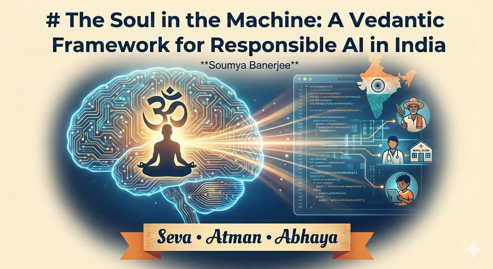

# The Soul in the Machine: A Vedantic Framework for Responsible AI in India

**Soumya Banerjee**

---

## Abstract

As India emerges as a global epicenter for Artificial Intelligence, the vacuum between rapid technological acceleration and ethical governance grows. This manuscript proposes a uniquely Indian framework for Responsible AI, anchored in the "Practical Vedanta" of Swami Vivekananda. Rather than viewing technology through a lens of mere compliance, this work synthesizes core Vedantic tenets, specifically *Seva* (service to the marginalized), *Atman* (the preservation of human agency), and Universalism (the mitigation of algorithmic bias), to advocate for a "conscience-driven" approach to innovation. The manuscript argues that India’s AI roadmap must move beyond profit-maximization to focus on "Man-making" education and the upliftment of the *Daridra Narayana* (the underserved). By integrating these timeless spiritual principles with modern data science, India can offer the world a "Third Way" of AI governance: one that balances fearless innovation with an unwavering commitment to human dignity and social harmony.

---

## I. Introduction: The Need for a Philosophical Anchor

As India emerges as a global hub for AI development, the conversation often centers on compute power, data sets, and regulatory sandboxes. However, for technology to truly serve a nation as diverse and spiritually rooted as India, it requires a moral "North Star." Swami Vivekananda’s philosophy (centered on the divinity of the individual and the mandate of selfless service) provides a profound framework for **Responsible AI**. It moves the conversation from mere "compliance" to "conscience."¹

---

## II. The Core Pillars of Vivekananda-Inspired AI

### 1. *Seva* (Service): AI for the "Daridra Narayana"

Vivekananda’s primary teaching was that service to humanity is service to God. In the context of AI, this shifts the focus from profit-maximization to **social impact**.

* **The Principle:** AI should not merely optimize ad-clicks; it should address the "wicked problems" of the marginalized.
* **Application:** Prioritizing AI in vernacular language translation for farmers, early diagnostic tools for rural health clinics, and personalized education for first-generation learners.

### 2. *Atman* (Self-Knowledge) and Human Agency

Vivekananda emphasized that "all power is within you." A responsible AI approach must ensure that technology **augments** rather than **diminishes** human agency.

* **The Principle:** AI should be a tool for self-realization, not a crutch that leads to intellectual atrophy.
* **Application:** Designing AI systems that are transparent and explainable, ensuring that the "human-in-the-loop" retains the moral and cognitive authority to make final decisions.

### 3. *Abhaya* (Fearlessness) and Innovation

He often said, "The transition from sorrow to joy is through fearlessness." Responsible AI in India should not be born out of a fear of technology, but out of the courage to build it safely.

* **The Principle:** We should not stifle innovation through over-regulation, but we must have the courage to halt systems that threaten social harmony.

---

**Would you like me to continue converting the rest of the manuscript structure we discussed into this formal format?**
