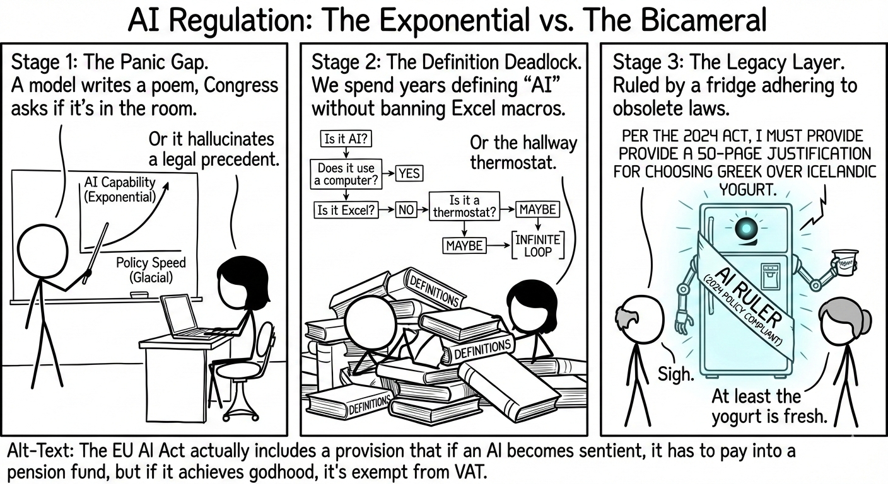

## The Yogurt Protocol: Why AI Regulation Moves at the Speed of Dial-Up

Randall Munroe (the creator of *xkcd* [https://xkcd.com/]) has a gift for taking complex socio-technical nightmares and distilling them into stick figures who are much smarter—and more tired—than the rest of us. This latest strip perfectly captures the **Great AI Policy Paradox**: we are trying to build a speed limit for a vehicle that is currently breaking the sound barrier, using tools designed for a horse and buggy.

---

### 1. The Panic Gap

The comic starts with the "Stage 1" reality we’re living in. AI moves exponentially; policy moves at the speed of a consensus-building luncheon. When a model hallucinates a fake law, the reaction isn't usually "how do we fix the weights?" but rather a frantic Congressional hearing where someone asks if the algorithm has a soul or if it can be turned off with a physical key.

### 2. The Definition Deadlock

My favorite panel is the flowchart. It highlights the biggest headache for the EU AI Act and similar bills: **The Definition Problem.** * If your definition is too broad, you’ve just accidentally regulated every calculator and hallway thermostat in the country.

* If it’s too narrow, the AI companies just rename their "Neural Network" to a "Sophisticated Statistical Regressor" and keep it moving.

### 3. The Legacy Layer (and the Yogurt)

The punchline is where the real truth lies. Legislation is permanent, but tech is transient. We are currently writing laws for **Large Language Models**, but by the time those laws are fully enforceable, we might be dealing with something entirely different—like the comic’s "Smart Fridge Ruler."

There is a profound irony in a hyper-intelligent entity being forced to follow a 2024 law that requires a 50-page justification for choosing Greek yogurt. It’s the ultimate bureaucratic victory: making the most efficient minds in the universe bogged down by the same paperwork that plagues the DMV.

---

**The Takeaway:** As the alt-text suggests, we’re more likely to tax an AI’s pension than we are to actually understand its "black box" logic. In the meantime, we should probably just listen to Megan: **Accept the Terms of Service and hope the hive-mind has good taste in dairy.**
